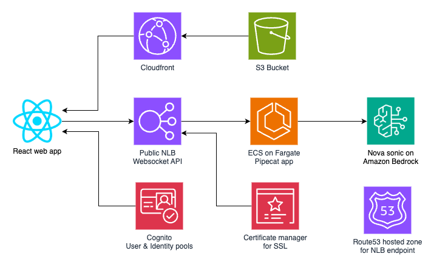

# Introduction
This is a prototype demonstrating Amazon nova sonic for a banking usecase. It displays a virtual banking assistant avatar on the screen and you can have a free form conversation with it regarding banking services. It uses a React based frontend app running in a browser, which connects to an ECS cluster behind an NLB. The backend uses Pipecat to implement the voice bot by using Amazon Nova sonic behind the scenes. Please see below for the architecture details.

# Architecture


The frontend is a React SPA web app which uses Cognito and Amplify client library for React to let users signin. Self signuo is disabled for security and users are to be created explicitly from the backend using Cognito AWS console CLI etc. The frontent is hosted in an S3 bucket and is served via a Cloudfront URL. The frontend connects to the backend using the public NLB using a API secret key to secure the access. Please note that a production system must implement a secure gateway to protect the public endpoint. The NLB uses SSL certificate from the certificate manager service to provide a secure endpoint which browsers will allow conecting to from the frontend. A Route53 hosted zone is also used to enable routing of the domain name to the NLB using an Alias record. The frontend connects to the NLB using websocket by providing the key as protcol which the backend will check to allow access.

The backend app is implemented using the Pipecat framework and uses a custom FrameSerializer that allows Base64 encoded raw audio to be streamed in directly. The responses are json structures where the `event` key will have a value if `media` if the `data` key has Base64 encoded audio. The `event` key's value may be `stop` as well which indicated that the frontend must immediately stop the playback and clear any queues. The stop event is triggered during interruption. The current implementation (pipecat-ai[aws-nova-sonic,silero]==0.0.74) of pipecat doesn't propgate interruption, so a patched version is used which is included in this code. 

The audio interaction is facilitated by Amazon nova sonic speech to speech understanding model which can directly ingest the audio and directly output its responses as audio as well. Unlike the STT-TTS based approach, nova sonic has excellent response times and allows completely natural non-monotonous voice interaction. Its responses will be spoken in a way suitable and natually apt for the conversation giving a human feel to the conversation.

# Prerequisites
- An AWS accout with admin access (Not root access).
- An EC2 Ubuntu machine.

# Setting up
- SSH into the EC2 Ubuntu machine.
- Install the dependencies
    ```
    cd ~
    sudo apt update
    sudo apt upgrade -y

    # Install python and venv
    sudo apt install python3 python3-pip python3-venv unzip poppler-utils ffmpeg -y
    python3 -m venv ~/venv
    source ~/venv/bin/activate

    # Install nodejs
    curl -o- https://raw.githubusercontent.com/nvm-sh/nvm/v0.40.3/install.sh | bash
    \. "$HOME/.nvm/nvm.sh"
    nvm install 22
    node -v
    npm -v

    # Install CDK
    npm install -g aws-cdk

    # Install AWS CLI
    curl "https://awscli.amazonaws.com/awscli-exe-linux-x86_64.zip" -o "awscliv2.zip"
    unzip awscliv2.zip
    sudo ./aws/install

    # Add Docker's official GPG key:
    sudo apt-get update
    sudo apt-get install ca-certificates curl
    sudo install -m 0755 -d /etc/apt/keyrings
    sudo curl -fsSL https://download.docker.com/linux/ubuntu/gpg -o /etc/apt/keyrings/docker.asc
    sudo chmod a+r /etc/apt/keyrings/docker.asc

    # Add the repository to Apt sources:
    echo \
    "deb [arch=$(dpkg --print-architecture) signed-by=/etc/apt/keyrings/docker.asc] https://download.docker.com/linux/ubuntu \
    $(. /etc/os-release && echo "${UBUNTU_CODENAME:-$VERSION_CODENAME}") stable" | \
    sudo tee /etc/apt/sources.list.d/docker.list > /dev/null
    sudo apt-get update

    # Install docker
    sudo apt-get install docker-ce docker-ce-cli containerd.io docker-buildx-plugin docker-compose-plugin -y

    # Setup permissions
    sudo groupadd docker
    sudo usermod -aG docker $USER
    newgrp docker
    ```

# Get and configure the 3D avatar.
- Download a free `.glb` 3d model with semaless idle animation. e.g rp_sophia_animated_003_idling_FBX from `https://renderpeople.com/sample/free/renderpeople_free_animated_people_FBX.zip` and converted to `glb` with Blender(https://www.blender.org/).
- Place the .glb model in the `frontend/react-web/public` folder.
- Update the model name and `jaw bone`'s name in the `frontend/react-web/src/aws-exports.js`

NOTE: Please verify the license yourselves before downloading and using these models. (https://renderpeople.com/general-terms-and-conditions/)

# Option 1: Frontend on localhost
- Decide the region to reply this prototype.
- Clone this repo into the EC2 Ubuntu machine.
- Set the api secret
    - Decide on a new random string as your api secret.
    - Change the `API_KEY` in `backend/app/main.py`
    - Change the `apiKey` in `frontend/react-web/src/aws-exports.js`
- Update the follownig in `backend/cdk.json`
    - `vpc-config` - Provide the VPC and subnet details where you want to deploy this prototype.
    - `certificate-arn` - Remove it.
- Deploy the CDK project
    ```
    cd backend
    source ~/venv/bin/activate
    python -m pip install -r requirements.txt
    cdk deploy
    ```
- Notedown the output values printed by the deployment.
- Update the `awsConfig` and `apiUrl` in `frontend/react-web/src/aws-exports.js` using the CDK output values. For `apiUrl`, use `ws://` as the protocol and `/ws` as the path. e.g. `"ws://Virtua-Virtu-NtKoYJqqVYQF-7b5c31eccbd320e3.elb.ap-south-1.amazonaws.com/ws"`
- Build and deploy the frontend
    ```
    cd ../frontend/react-web
    npm install
    npm start
    ```

# Option 2: Frontend on Cloudfront
- Decide the region to reply this prototype.
- Decide on the domain to be used with the NLB 
- Create an ACM certificate for this domain in the same region and get it verified.
- Clone this repo into the EC2 Ubuntu machine.
- Set the api secret
    - Decide on a new random string as your api secret.
    - Change the `API_KEY` in `backend/app/main.py`
    - Change the `apiKey` in `frontend/react-web/src/aws-exports.js`
- Update the follownig in `backend/cdk.json`
    - `vpc-config` - Provide the VPC and subnet details where you want to deploy this prototype.
    - `certificate-arn` - Provide the ARN of the ACM certificate to be used with the NLB.
- Deploy the CDK project
    ```
    cd backend
    source ~/venv/bin/activate
    python -m pip install -r requirements.txt
    cdk deploy
    ```
- Notedown the output values printed by the deployment.
- Create a Route53 public hosted zone for your domain name.
- Update the NS records with your domain registrar to redirect the domain to Route53.
- Add an alias A record in Route53 for the DNS name of the NLB. 
- You may have to wait about 30 minutes for the DNS propagation
- Update the `awsConfig` and `apiUrl` in `frontend/react-web/src/aws-exports.js` using the CDK output values. For `apiUrl`, use `wss://` as the protocol and `/ws` as the path. e.g. `"wss://vba.example.acme/ws"`
- Build and deploy the frontend
    ```
    cd frontend/react-web
    npm install
    npm run build
    aws s3 cp build s3://<Bucket created by this stack> --recursive
    ```

# Making changes
- If you change backend, run `cdk deploy` again to redeploy
- If userpool, identity pool or api endpoint changes, update that in `aws-exports.js` in the frontend
- Deploy the frontend by building it again, copying to the S3 bucket and initiating a full invalidate for the Cloudfront distribution.

# Testing
- Create a new user in the Userpool created by this stack using an email address.
- Open the Cloudfront URL for the frontend in Chrome browser. (When deployed on Cloudfront)
- Signin using the user credentials, and click on the `Enage` button in the header. Initial connection may take a few seconds.
- Once engaged, the virtual avatar will greet you and you can start conversing with it.
- Try having a natural conversation with it. You can also try interrupting it.